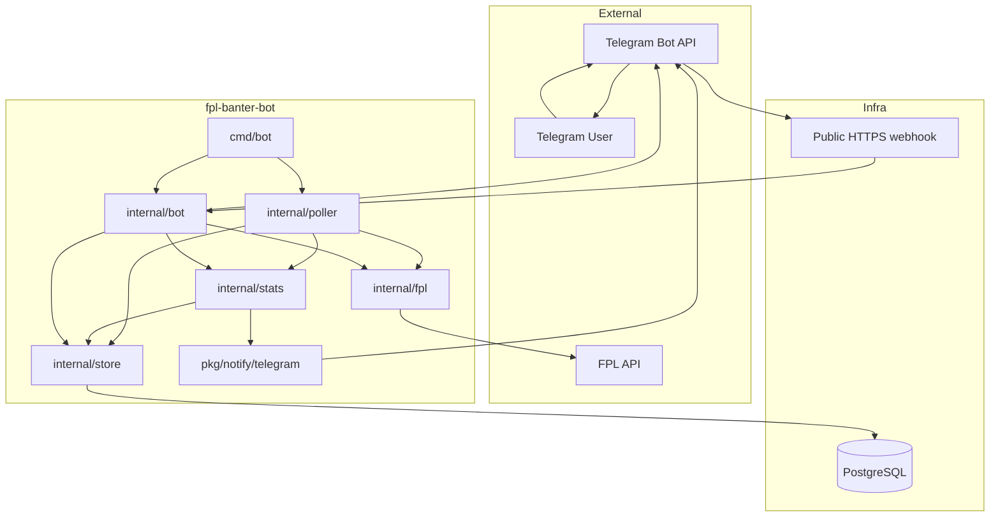

# fpl-banter-bot

[](https://github.com/chrislonge/fpl-banter-bot/actions/workflows/ci.yml)

A self-hosted Fantasy Premier League banter bot for head-to-head mini-leagues. It watches the FPL API, stores finished gameweeks in Postgres, posts an awards-first recap to Telegram, and answers a small set of league commands on demand.

## What the bot does

After a gameweek finalizes, the bot builds one recap message that leads with an awards ceremony and then follows with the rest of the weekly banter:

- `🏆 Manager of the Week`
- `💩 Wooden Spoon`
- `🎯 Captain Genius`
- `🤡 Armband of Shame`
- `🪑 Bench Warmer`
- `💀 Biggest Thrashing`
- `🎰 Luckiest Win`
- `😤 Unluckiest Loss`
- rank changes
- win and loss streaks
- chip usage
- H2H results

The bot also supports Telegram commands for quick lookups:

- `/standings`
- `/streak`
- `/history <manager1> <manager2>`
- `/deadline`

## How it works



There are two main paths through the system:

- Proactive: the poller detects that a gameweek has finalized, persists the snapshot, computes the recap, and sends it to Telegram.
- Reactive: a Telegram user sends a command and the webhook handler replies with data from the store, stats engine, or FPL API.

## Quick start

### Prerequisites

- Go `1.26+`
- Docker and Docker Compose
- A Postgres connection string
- Your FPL league ID
- Telegram bot credentials if you want chat delivery

`golang-migrate` is optional. Migrations run automatically on startup.

### 1. Clone and configure

```bash
git clone https://github.com/chrislonge/fpl-banter-bot.git
cd fpl-banter-bot
cp .env.example .env
```

Edit `.env` with your league, database, and Telegram values.

### 2. Start Postgres

```bash
make db-up
```

### 3. Run the bot

```bash
make run
```

The bot will:

- run embedded database migrations
- connect to the FPL API
- start the gameweek lifecycle poller
- optionally register Telegram commands and start the webhook server when Telegram is configured

### 4. Configure Telegram delivery

If `TELEGRAM_BOT_TOKEN` and `TELEGRAM_CHAT_ID` are set, the bot runs in full mode and sends recaps automatically. Telegram webhooks require a public HTTPS URL, so you also need `WEBHOOK_BASE_URL`.

Tailscale Funnel works well for this:

```bash
sudo tailscale funnel --bg 8080
```

Set `WEBHOOK_BASE_URL` to the resulting `https://...ts.net` URL.

If Telegram credentials are omitted, the bot still polls FPL and stores data, but it does not send notifications or start the webhook server.

## Current-season backfill and enrichment

If the bot started after the season was already underway, you can fill in missing finished gameweeks from the current season:

```bash
make backfill
```

For Docker-based deployments:

```bash
make docker-backfill
```

Backfill is:

- current-season only
- idempotent
- resumable across runs

It also enriches already-stored gameweeks that are missing weekly manager stats or stored award winners.

Important limitation: FPL does not provide historical league-table snapshots. Backfilled standings are tagged as synthetic because they reflect the current cumulative table, not the exact ranks from that past gameweek. H2H results, bench points, captain picks, and award calculations still use real gameweek data from the current season.

## Commands

Users in the configured Telegram chat can run:

- `/standings` to see the current league table
- `/streak` to see active win and loss streaks
- `/history <manager1> <manager2>` to compare two managers head to head
- `/deadline` to see the next deadline in the configured timezone

Commands are registered with Telegram on startup, so users get autocomplete in chat.

To resend a stored recap for a previous gameweek, use `cmd/notify-test` from your workstation or server. There is not yet an in-chat `/recap <gw>` command.

## Configuration

All configuration comes from environment variables. See [`.env.example`](.env.example) for the full template.

| Variable | Required | Description |
| --- | --- | --- |
| `FPL_LEAGUE_ID` | Yes | Your FPL league ID |
| `FPL_LEAGUE_TYPE` | No | League type. This bot currently supports `h2h` |
| `DATABASE_URL` | Yes | Postgres connection string |
| `STORE_TEST_DATABASE_URL` | No | Postgres URL for store integration tests |
| `TELEGRAM_BOT_TOKEN` | No | Telegram bot token from BotFather |
| `TELEGRAM_CHAT_ID` | No | Telegram chat ID to post into |
| `WEBHOOK_BASE_URL` | When Telegram is enabled | Public HTTPS base URL for Telegram webhooks |
| `WEBHOOK_PORT` | No | Local webhook port. Default `8080` |
| `WEBHOOK_SECRET` | No | Secret path component for the webhook |
| `POLL_IDLE_INTERVAL` | No | Seconds between polls when no gameweek is live |
| `POLL_LIVE_INTERVAL` | No | Seconds between polls during a live gameweek |
| `POLL_PROCESSING_INTERVAL` | No | Seconds between polls while FPL is still processing results |
| `DEADLINE_TIMEZONE` | No | IANA timezone for `/deadline` |
| `LOG_LEVEL` | No | `debug`, `info`, `warn`, or `error` |
| `LOG_FORMAT` | No | `text` (human-readable) or `json` (structured). Default `text` |

## Project layout

```text
cmd/bot/             Main bot process
cmd/backfill/        Current-season backfill and enrichment command
cmd/notify-test/     End-to-end recap preview tool
internal/bot/        Telegram webhook server and command handlers
internal/config/     Environment loading and validation
internal/fpl/        FPL client and API response models
internal/poller/     Gameweek lifecycle polling and snapshot collection
internal/stats/      Alert and awards computation
internal/store/      Postgres store, queries, and embedded migrations
pkg/notify/          Alert types and notifier interface
pkg/notify/telegram/ Telegram formatter and delivery client
```

## Development and verification

PRs to `main` run lint (`golangci-lint`, `go vet`) and the full test suite automatically, including store integration tests against a real Postgres instance. Both jobs must pass before merging.

Common commands:

```bash
make build
make test
make test-store
make test-telegram
make notify-test
make db-up
make db-down
make db-reset
```

### Preview a real recap without sending it

`cmd/notify-test` runs the full store -> stats -> Telegram formatting path against your database and prints the exact recap shape in dry-run mode.

```bash
make notify-test DRY_RUN=1
make notify-test GW=12 DRY_RUN=1
make notify-test DRY_RUN=1 VERIFY=1 VERIFY_LAST=8
```

This is the fastest way to verify the awards-first recap before posting to Telegram.

`VERIFY=1` turns on a multi-gameweek verification pass. It scans stored gameweeks, reports which awards appear or are omitted, flags missing captain data, and prints representative previews for edge cases such as missing armband-of-shame and captain-gap handling.

`notify-test` is a host-side tool. For a minimal Docker-only Pi setup, the usual workflow is:

- restore or copy the Pi database into a local dev database
- run `make notify-test DRY_RUN=1` or `VERIFY=1 ... make notify-test` on your laptop
- deploy to the Pi and run `make docker-backfill`

To send a stored recap for a specific gameweek to Telegram instead of previewing it, run:

```bash
make notify-test GW=31
```

Use `DRY_RUN=1` if you want to preview the exact message without sending it.

### Run the full test suite

```bash
go test ./...
```

### Optional live API checks

The `internal/fpl` package includes integration tests against the real FPL API. They are skipped by default.

```bash
FPL_LIVE_TEST=1 go test ./internal/fpl/ -run TestLiveAPI -v
```

### Store integration tests

Store tests use a real Postgres database when `STORE_TEST_DATABASE_URL` is set.

```bash
make test-store
```

### Telegram integration test

You can also send a real formatting test message to your Telegram chat:

```bash
make test-telegram
```

### Viewing logs

The bot uses structured logging via Go's `slog` package. Set `LOG_FORMAT` to control the output format.

#### Docker deployments

```bash
# Follow live output
docker compose logs -f bot

# Last 100 lines then follow
docker compose logs -f --tail=100 bot

# Logs since a point in time
docker compose logs --since=1h bot
```

Postgres logs are available via `docker compose logs db`.

#### Local development

`LOG_FORMAT=text` (default) produces human-readable output, good for local development:

```
time=2026-03-31T10:00:00Z level=INFO msg="poller starting" component=poller league_id=12345
time=2026-03-31T10:00:00Z level=DEBUG msg="sleeping until next tick" component=poller state=idle interval=21600000000000
```

`LOG_FORMAT=json` produces one JSON object per line, suitable for log aggregators (Grafana Loki, Datadog) or `jq` filtering:

```bash
# Live-filter logs to a single component
make run 2>&1 | jq -R 'try fromjson | select(.component == "poller")'

# Show only warnings and errors
make run 2>&1 | jq -R 'try fromjson | select(.level == "WARN" or .level == "ERROR")'
```

Every log line carries a `component` field (`fpl`, `store`, `poller`, `stats`, `telegram`, `bot`) so you can isolate any layer of the stack. Set `LOG_LEVEL=debug` to see HTTP call traces and state machine transitions.

## Deployment notes

The bot is a good fit for a Raspberry Pi or any small always-on Linux host. Docker Compose is the simplest deployment path:

```bash
make deploy
make docker-backfill
```

`make docker-backfill` rebuilds the one-shot backfill image before running it, which keeps it in sync with the latest checked-out code.

If your bot runs in containers, set `DATABASE_URL` to use the Postgres service name from Compose, for example `postgres://fplbot:password@db:5432/fplbanterbot?sslmode=disable`.

## Cutting a Release

Releases are cut from `main`. CI automatically builds and pushes an ARM64 Docker image to GHCR on every version tag.

```bash
make release VERSION=0.6.0
```

This will:
1. Run `lint` and `test` as a local sanity check
2. Bump the image tag in `docker-compose.yml` to the new `major.minor`
3. Commit, tag `v0.6.0`, and push both to `origin`

CI then builds `ghcr.io/chrislonge/fpl-banter-bot:0.6.0`, `0.6`, and attests build provenance. Monitor the run in GitHub → Actions.

**Patch releases** (e.g. `0.5.0` → `0.5.1`) do not require a `docker-compose.yml` change — the `0.5` tag already tracks the latest patch. Just commit the fix and run `make release VERSION=0.5.1`.

**Access control:** Pushes to `v*` tags are protected by a GitHub ruleset — only the repo owner can create or delete release tags. Add bypass permission explicitly in Settings → Rules → Release tags if you add collaborators who need to cut releases.

**Deploying to the Pi after a release:**

```bash
git pull
docker compose pull bot
docker compose stop bot && docker compose up -d bot
```

## Limitations

- Head-to-head leagues only
- Telegram full mode requires a public HTTPS webhook URL
- Backfill and enrichment are limited to the current season
- Backfilled standings are synthetic because the FPL API does not expose historical league-table snapshots

## License

[MIT](LICENSE)
